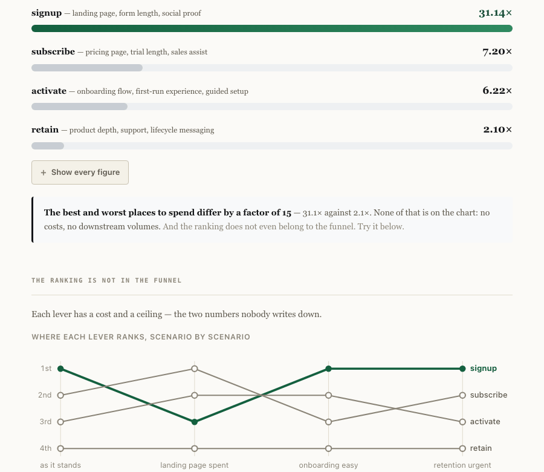

# The funnel chart cannot tell you what to fix

A five-step acquisition funnel, measured on the individuals rather than the totals, and then
priced: what is one point of improvement at each step actually worth, against what it costs
to get.

<!-- figures:finding -->
**The finding.** The best and worst places to spend on this funnel differ by **15×** — `signup` returns 31.1× the money put into it, `retain` returns 2.1×. A funnel chart cannot tell you that, and not because you are reading it wrong: it carries **no costs and no downstream volumes**, which are the only two facts that decide. Change one belief about what a fix costs — nothing about the users, not a single bar on the chart — and the order changes.
<!-- /figures:finding -->

**[Try it in your browser →](https://arslanesempai-ui.github.io/funnel-economics/)** — raise what a lever costs and watch the ranking turn over. Nothing about the users changes; the order does.



```bash
npm run measure      # the funnel, with an interval on every rate
npm run value        # what fixing each step is worth, and what it costs
npm run sensitivity  # which inputs decide the ranking, and which do not
npm run adversarial  # five funnels where the obvious reading is wrong
npm run baselines    # against deciding with no analysis at all
npm test             # types, README figures, and 16 tests
```

Everything runs locally. No API key, nothing leaves the machine, and anyone who clones this
reproduces every number below.

---

## The funnel

<!-- figures:funnelTable -->
| Step | Entered | Converted | Rate | 95 % interval | ± points |
|---|---|---|---|---|---|
| `signup` | 120,000 | 21,415 | 17.8 % | [17.6 % – 18.1 %] | 0.4 |
| `activate` | 21,415 | 12,102 | 56.5 % | [55.8 % – 57.2 %] | 1.3 |
| `subscribe` | 12,102 | 2,648 | 21.9 % | [21.2 % – 22.6 %] | 1.5 |
| `retain` | 2,648 | 2,009 | 75.9 % | [74.2 % – 77.5 %] | 3.3 |
<!-- /figures:funnelTable -->

<!-- figures:funnelNote -->
2,009 of 120,000 visits end up retained — **1.7 %** [1.60–1.75].

Worst step by rate: `signup` at 17.8 %. No other step's interval reaches it, so the ranking holds — which is not the usual case.
<!-- /figures:funnelNote -->

Every rate carries its interval, which is the column analytics tools leave off. A step
measured on 2,600 people is a different kind of object from one measured on 120,000, and
putting them in the same column invites a comparison neither sample supports.

---

## What each fix is worth

Priced by **re-running the funnel** with the improvement applied, not by multiplying rates
on a page. The two agree only when every step is independent of every other — which they
are in this model and are not in life, and that limitation is stated rather than hidden
behind a spreadsheet.

<!-- figures:valueTable -->
| Step | Points | Extra customers/yr | Extra revenue | Cost | Per $ | Chart rank |
|---|---|---|---|---|---|---|
| `signup` | +4 pt | 1,038 | $1,245,600 | $40,000 | **31.14×** | 1 |
| `subscribe` | +6 pt | 1,080 | $1,296,000 | $180,000 | **7.20×** | 2 |
| `activate` | +10 pt | 622 | $746,400 | $120,000 | **6.22×** | 3 |
| `retain` | +8 pt | 456 | $547,200 | $260,000 | **2.10×** | 4 |
<!-- /figures:valueTable -->

### The same funnel, one belief changed

<!-- figures:reorder -->
Suppose the landing page has already been rebuilt twice, so signup is **$90,000 for one point** rather than $40,000 for four. Nothing about the users changes. Not one bar on the chart moves.

| | Order by return |
|---|---|
| before | `signup` → `subscribe` → `activate` → `retain` |
| after | `subscribe` → `activate` → `signup` → `retain` |

The ranking was never a property of the funnel. It is a property of the levers — and the levers are the part nobody writes down.
<!-- /figures:reorder -->

---

## Which inputs decide the ranking

The funnel rates are measured. Everything that turns them into an ordering is not, and the
sweep reports the range over which the **ranking** holds — not the range over which the
numbers hold, which would be a much weaker claim. The numbers move constantly; what matters
is whether the first thing to fix is still the first thing to fix.

<!-- figures:sensitivity -->
| Input | In use | Ranking unchanged over | Verdict |
|---|---|---|---|
| `annualRevenuePerCustomer` | $1,200 | $50 – $50,000 | no effect on the order |
| `costPerPaidVisit` | 2.40 | 0.05 – 50.00 | no effect on the order |
| `monthsToShip` | 3.00 | 0.50 – 18.00 | no effect on the order |
| `cost of fixing signup` | $40,000 | $8,000 – $168,000 | **decides** |
| `cost of fixing activate` | $120,000 | $104,000 – $344,000 | **decides** |
| `cost of fixing subscribe` | $180,000 | $45,600 – $204,000 | **decides** |
| `cost of fixing retain` | $260,000 | $93,600 – $1,300,000 | **decides** |

The revenue per customer scales every step equally, so it moves every figure on the page and changes nothing about which to fix first. That is the assumption a reader is most likely to argue about, and the one that matters least. The lever costs are the opposite: the least known numbers here, and the only ones that reorder the answer.
<!-- /figures:sensitivity -->

---

## Five funnels where the obvious reading is wrong

None of these is a mistake in the arithmetic. Every number in them is correct, and every one
means something other than what it appears to. That is the failure a confidence interval
does not protect against, which is why they are named rather than scored.

<!-- figures:traps -->
### Every segment improved and the total fell

**Appears to say.** Signup conversion dropped from month 0 to month 5. Whatever shipped in month 3 made things worse, and should be rolled back.

**Actually.** Signup improved by two points in both channels — it was shipped deliberately and it worked. Paid traffic went from a fifth of the mix to two thirds over the same period, and paid converts at half the rate organic does. The mix moved, not the product.

```
  everyone                19.2 %  →    16.5 %   DOWN
    organic only          21.6 %  →    24.0 %   up
    paid only              9.4 %  →    12.4 %   up
  paid share of traffic   20.0 %  →    65.0 %
```

**How to catch it.** Never compare an aggregate rate across periods when the mix can move. Split by channel first, every time — and if the channel split is not in your data, that is the finding.

### The last step looks best because only the best get there

**Appears to say.** Retention is 76 % — the healthiest step in the funnel. Nothing to do here.

**Actually.** Retention is measured on people who already signed up, activated and paid. They are the most committed users the funnel produces, three filters deep. A 76 % rate among them says nothing about whether the product retains anybody else, because nobody else is in the denominator.

```
  signup        17.8 %   on  120,000 people   ±0.4 points
  activate      56.5 %   on   21,415 people   ±1.3 points
  subscribe     21.9 %   on   12,102 people   ±1.5 points
  retain        75.9 %   on    2,648 people   ±3.3 points
```

**How to catch it.** Read every step's rate together with the size of its denominator. A rate on 2,600 people who survived three filters is a different kind of object from a rate on 120,000 arrivals, and putting them in the same column invites the comparison.

### A decimal place that is not there

**Appears to say.** Retention moved from 75.9 % to 77.1 %. Up 1.2 points — the lifecycle work is paying off.

**Actually.** The interval on that rate is over three points wide. A 1.2-point move is inside it, which means the two numbers are the same number as far as this sample can tell. The dashboard printed a decimal place it had not earned.

```
  retain: 2,009 of 2,648
  rate 75.9 %, 95 % interval [74.2 % – 77.5 %] — wider than the 1.2-point "improvement"
```

**How to catch it.** Ask for the denominator before believing a decimal. 2,600 observations buy you roughly ±1.7 points at 95 %; anything finer is decoration.

### The rate fell and the business grew

**Appears to say.** Signup conversion is down. The top of the funnel is broken.

**Actually.** More traffic at a lower rate can produce more customers than less traffic at a higher one. A rate is a ratio, and a ratio deliberately throws away the number that pays the bills.

```
  month 0:  19.2 % of 20,000 = 3,840 signups
  month 5:  16.1 % of 45,755 = 7,387 signups
  (this trap runs on a variant where traffic grows 18 % a month — the published funnel is flat)
```

**How to catch it.** Put the count beside every rate. If a chart shows only percentages, it cannot tell you whether the business grew.

### Ranking two steps the sample cannot tell apart

**Appears to say.** Activation is our second-worst step, so it is second on the roadmap.

**Actually.** Two steps whose intervals overlap are not ranked by any sample that produced them. Ordering a roadmap by a difference smaller than the measurement error is ordering it at random, with a chart to blame afterwards.

```
  signup      [17.6 % – 18.1 %]
  activate    [55.8 % – 57.2 %]
  subscribe   [21.2 % – 22.6 %]
  retain      [74.2 % – 77.5 %]
```

**How to catch it.** Before ranking, check whether the intervals overlap. If they do, the ranking is a coin toss and the honest output is a tie.
<!-- /figures:traps -->

---

## Against doing no analysis at all

A tool that recommends something is only worth its complexity if it beats what somebody
would have done without it. Three of the four strategies below need no data.

<!-- figures:baselines -->
| Way of deciding | What it needs | Picks | Return |
|---|---|---|---|
| **this tool** | the funnel, the levers, a price per customer | `signup` | 31.14× |
| fix the worst step | a funnel chart | `signup` | 31.14× |
| fix retention | nothing | `retain` | 2.10× |
| fix the cheapest | a budget | `signup` | 31.14× |

**The chart agrees with the analysis here, and that is worth saying plainly rather than hiding.** On this funnel a reader would have reached the same answer for free. What the analysis adds is knowing *that* the chart is right — and the sweep above shows how little has to change for it to stop being.
<!-- /figures:baselines -->

---

## Where every number comes from

<!-- figures:provenance -->
**4 measured**, **3 assumed**, **4 chosen**. What each kind means, and what you are entitled to ask of it:

- **measured** — running the code in this repository produces it. *run it yourself — the draws are seeded.*
- **assumed** — an input nobody here can know; yours to supply. *put your own figure in, and read the band around it.*
- **chosen** — my judgement and nothing else. *check whether the sweep says it decides anything.*

| Kind | Name | What it is | Note |
|---|---|---|---|
| measured | `step rates` | conversion at each step, with a 95 % interval | measured on the synthetic population below — see `TRUE_RATES` |
| measured | `worstStep` | which step converts worst, and whether the sample can say so at all | returns a tie when intervals overlap, rather than inventing a ranking |
| measured | `extraRetained` | customers a given improvement produces, per year | by re-running the funnel, not by multiplying rates on a page |
| measured | `traps` | five funnels where the obvious reading is wrong | each checked against the generator's ground truth, which a real dashboard has not got |
| assumed | `annualRevenuePerCustomer` | what one retained customer is worth in a year | your finance team knows this; the sweep shows it does not change the ranking |
| assumed | `costPerPaidVisit` | what one paid visit costs | your ad platform knows this exactly |
| assumed | `monthsToShip` | how long a fix takes to reach users | your own delivery history |
| chosen | `LEVERS` | what each fix costs, and how far it can move its step | the load-bearing choice: the ranking is a property of these, not of the funnel — and nobody publishes them |
| chosen | `TRUE_RATES` | the generator's per-channel conversion rates | shaped so paid converts worse at the top and better at the bottom, which is what makes the mix matter |
| chosen | `SCENARIO` | 6 months, 20,000 visits a month, paid share 20 % → 65 % | the mix shift is deliberate; it is what produces the Simpson's-paradox trap |
| chosen | `no retrieved figures` | the decision to cite nothing | growth benchmarks are published by companies selling the thing benchmarked; citing one would look like rigour and be the opposite |
<!-- /figures:provenance -->

**This is the only tool in the portfolio with no retrieved figures at all**, and the absence
is a decision rather than an oversight. The compliance tools rest on the Code of Federal
Regulations: a public text, dated, quotable, needing no defence from me. There is no
equivalent for growth. Conversion benchmarks exist and are published by companies selling
the thing being benchmarked; citing one would look like rigour while being the opposite. So
nothing is retrieved here, and that is stated instead of leaving an empty column.

---

## What this does not let you conclude

**Not "signup is where you should spend."** Signup is where you should spend *on this
funnel, under these levers*. The whole point of the reordering above is that the second half
of that sentence does the work, and it is the half nobody writes down.

**Not "the numbers are the finding."** The funnel is synthetic and its rates are mine. What
travels is the method: price the fix, not the leak; check whether the sample can rank at all;
split by segment before comparing any aggregate across time.

**Not "a 15× spread means the chart is useless."** On this funnel the chart happens to point
at the right step. The analysis tells you *that* it does — and the sweep shows how little has
to change before it stops.

**Not "these traps are curiosities."** Every one of them is a decision somebody makes on a
Monday. The mix-shift trap in particular is the ordinary consequence of turning up paid
spend, and the ordinary conclusion drawn from it is to roll back a change that worked.

---

## What I would do differently

**Write the levers before the funnel.** I built the measurement first and discovered late
that the interesting question is not "which step leaks" but "what does each fix cost". The
levers are the load-bearing input and they arrived last, which is backwards.

**Check each trap against its own scenario before writing the claim.** The volume trap
originally ran on a funnel with flat traffic — where a falling rate also means falling
counts — and printed evidence contradicting the sentence above it. A trap needs a world in
which it happens, and there is now a test that checks the evidence supports the claim.

**Model the dependence between steps.** Improving signup produces more, worse signups, and
the activation rate that follows is not the one measured before. This tool re-runs the funnel
rather than multiplying rates, which keeps the door open — but the population model does not
represent the dependence yet, so the door leads nowhere.

---

## What a reviewer can check without running anything

| Claim | Where it is checked |
|---|---|
| Every figure on this page | Generated from the model; `npm test` fails if the page drifts |
| The measurement itself | Held against the generator's true rates, which a real funnel has not got |
| Every rate | Carries its 95 % interval, and is withheld below 20 observations |
| Every ranking | Refused when the intervals overlap, rather than invented |
| The reordering claim | A test fails if the alternative levers stop changing the order |
| Every trap | A test fails if its evidence stops supporting its claim |
| The tool itself | Compared against three ways of deciding that need no data |
| The draw | Seeded — a stranger running `npm test` gets these exact numbers |

---

**Arslane Chaouche Ramdane** — six years in AML/KYC and financial crime operations, moving
into BizOps and AI transformation work. The other tools here price a compliance threshold,
route work across model tiers, and say whether a change to a screening system broke anything.
This one asks the same question on the growth side: what is the thing you are about to spend
a quarter on actually worth?
